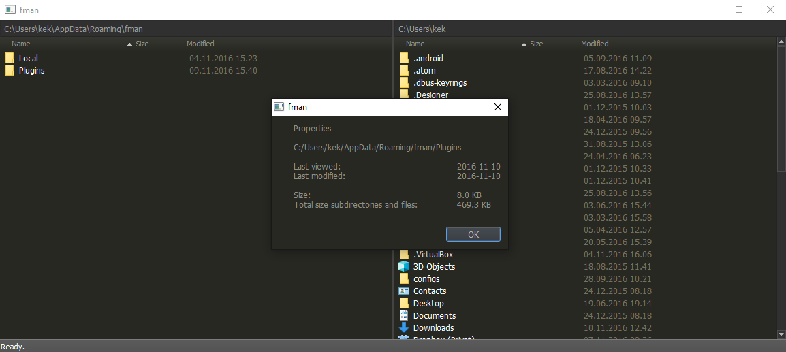
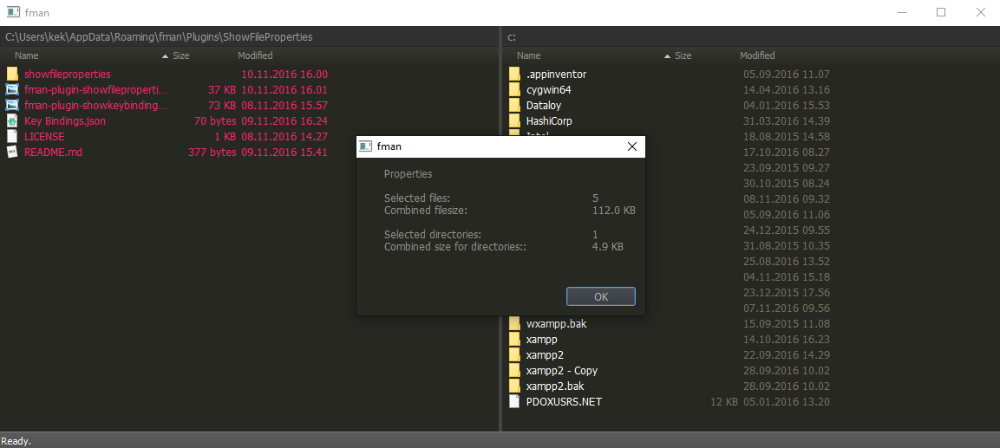

# ShowFileProperties

Plugin for [fman.io](https://fman.io) to see file/directory properties.

Install by uploading "ShowFileProperties" to your [data directory](https://fman.io/docs/customizing-fman)`/Plugins`.

**Usage**

Select one or more files/directories and press **Alt+Enter**

**Warning**: Currently it runs in the same process/thread so be aware that running properties on a large dir will cause the UI to hang while calculating size

** Features **

 - Shows total filesize for selected files/directories
 - If a directory is selected, also show size for subfiles/subdirectories
 - If a single file/directory is selected, show last accessed and last modified dates
 - If you haven't selected anything it will show properties for the currently hovered file/dir

** Todo **

 - Implement threading or multiprocessing for calculating size on subfiles/subdirectories
 - Show more metadata in addition to last accessed and last modified
 - Format date to be same as fman (dd.mm.yyyy instead of yyyy-mm-dd)
 - ++

**Screenshot**

