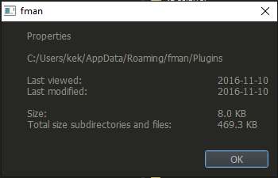

# ShowFileProperties

Plugin for [fman.io](https://fman.io) to see file/directory properties.

Install by uploading ShowFileProperties to [data directory](https://fman.io/docs/customizing-fman)`/Plugins/User` or use the Plugin manager in fman.

**Usage**

Select one or more files/directories and press **Alt+Enter**

**Features**

 - Shows total filesize for selected files/directories
 - If a directory is selected, also show size for subfiles/subdirectories
 - If a single file/directory is selected, show last accessed and last modified dates
 - If you haven't selected anything it will show properties for the currently hovered file/dir

**Screenshot**

